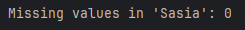

# Importimi tregtar në Doganat e Kosovës
<strong>Titulli i projektit</strong>: Bilanci tregtar në Doganat e Kosovës 
<strong>Universiteti</strong>: Universiteti i Prishtinës "Hasan Prishtina" 
<strong>Fakulteti</strong>: Fakulteti i Inxhinierisë Elektrike dhe Kompjuterike, Programi: Inxhinieri Kompjuterike dhe Softuerike, 2024/25 
<strong>Niveli</strong>: Master 
<strong>Lënda</strong>: Machine Learning 
<strong>Mësimdhënësit e lëndës</strong>: Prof. Dr. Lule Ahmedi, Ass. Dr. Mërgim Hoti 
<strong>Punuar nga</strong>: Erëblina Berisha, Njomza Rexhepi

Ky repository përmban projektin semestral për lëndën Machine Learning, me fokus në analizën e të dhënave lidhur me importet në Kosovë për vitet 2023-2024.
Burimi i të dhënave: Dogana e Kosovës - Open Data

https://dogana.rks-gov.net/OpenData/Index?id=4

## Dataset-i i përdorur për analizë
Dateseti përmban 11 kolona (atribute) dhe 233.639 rreshta (objekte). 

## Atributet e datasetit: 

VITI: Viti i transaksionit.

MUAJI: Muaji i transaksionit.

Regjimi: Regjimi ose lloji i transaksionit (p.sh., IM4, që ndoshta tregon një kategori specifike importi).

Origjina: Vendi i origjinës së mallrave të importuara (p.sh., CN - KINA, PL - POLONIA, etj.).

Kodi Tarifor: Një kod specifik i produktit që përdoret për klasifikimin doganor (p.sh., 8807100090, 8529101190).

Sasia: Sasia e mallrave të importuara (në disa raste, kjo është bosh, që mund të tregojë shërbime ose artikuj jo të matshëm).

Vlera Mallrave: Vlera monetare e mallrave të importuara.

Netweight: Pesha neto e mallrave (në disa raste, kjo është bosh ose zero).

Taksa Doganës: Taksa doganore e aplikuar për mallrat.

Taksa Akcizës: Taksa e akcizës e aplikuar për mallrat (në shumicën e rasteve, kjo është zero).

Taksa TVSH-së: Taksa mbi vlerën e shtuar (TVSH) e aplikuar për mallrat.

## Përshkrimi i Dataset-it:

Ky dataset përfaqëson të dhëna për importet në Kosovë për një periudhë të caktuar. Çdo rresht korrespondon me një artikull të importuar, duke përfshirë detaje rreth origjinës, llojit të produktit, sasisë, vlerës dhe taksave të lidhura. Dataset-i përfshin informacione specifike për produktet (p.sh., kodet tarifore) dhe informacione financiare (p.sh., vlera, taksat).

# Fazat e projektit
## Faza 1: Parapërpunimi i të dhënave

1. Tipet e të dhënave, kualiteti i të dhënave, numri i të dhënave të plota dhe ato null (të zbrazëta) 
2. Gjendja e të dhënave të lexueshme si tërësi, Strategjia e trajtimit të vlerave të zbrazëta, Mostrimi 
3. Pastrimi, normalizimi dhe transformimi i të dhënave. 
4. Detektimi i outliers dhe identifikimi i klasëve të shtrembëra. 

## Rezultatet nga faza 1:

Tipet e të dhënave në dataset: 

Përshkrimi i të dhënave numerike: 

Përshkrimi i të dhënave jonumerike: 

Përqindja e rreshtave duplikatë: 

Vlerat e zbrazëta nëpër kolona: 
 

Standardizimi apo normalizimi i atributit Kodi Tarifor, për përpunim më të lehtë: 

Frekuencat e kategorive të atributit Origjina: 

Vizualizimi i marrëdhënies midis dy atributeve numerike: 

Matrica e korrelacionit: 

Procesi i mbushjes së të dhënave ku vlerat që mungojnë (null) në kolonën 'Sasia' parashikohen bazuar në veçori të tjera (p.sh., 'Netweight', 'Vlera Mallrave', 'Taksa TVSH-së') duke përdorur një model RandomForestRegressor: 

Detektimi i outliers: 

Trajtimi i outliers duke përdorur metodën e IQR: 

Koeficienti i anueshmërisë: 

Transformimi i të dhënave në kolonat Origjina dhe Kodi Tarifor: 

Identifikimi i klasëve të shtrembëra: 

Histogramet për kolonën Netweight: 

