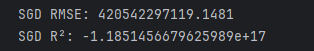

# Importimi tregtar në Doganat e Kosovës

<table border="0">
 <tr>
    <td></td>
    <td>
      <strong>Titulli i projektit</strong>: Bilanci tregtar në Doganat e Kosovës 
      <strong>Universiteti</strong>: Universiteti i Prishtinës "Hasan Prishtina" 
      <strong>Fakulteti</strong>: Fakulteti i Inxhinierisë Elektrike dhe Kompjuterike, Programi: Inxhinieri Kompjuterike dhe Softuerike, 2024/25 
      <strong>Niveli</strong>: Master 
      <strong>Lënda</strong>: Machine Learning 
      <strong>Mësimdhënësit e lëndës</strong>: Prof. Dr. Lule Ahmedi, Ass. Dr. Mërgim Hoti 
      <strong>Punuar nga</strong>: Erëblina Berisha, Njomza Rexhepi
    </td>
 </tr>
</table>

Ky repository përmban projektin semestral për lëndën Machine Learning, me fokus në analizën e të dhënave lidhur me importet në Kosovë për vitet 2023-2024.
Burimi i të dhënave: Dogana e Kosovës - Open Data

https://dogana.rks-gov.net/OpenData/Index?id=4

## Dataset-i i përdorur për analizë
Dateseti përmban 11 kolona (atribute) dhe 233.638 rreshta (objekte). 

## Atributet e datasetit: 

VITI: Viti i transaksionit.

MUAJI: Muaji i transaksionit.

Regjimi: Regjimi ose lloji i transaksionit (p.sh., IM4, që ndoshta tregon një kategori specifike importi).

Origjina: Vendi i origjinës së mallrave të importuara (p.sh., CN - KINA, PL - POLONIA, etj.).

Kodi Tarifor: Një kod specifik i produktit që përdoret për klasifikimin doganor (p.sh., 8807100090, 8529101190).

Sasia: Sasia e mallrave të importuara (në disa raste, kjo është bosh, që mund të tregojë shërbime ose artikuj jo të matshëm).

Vlera Mallrave: Vlera monetare e mallrave të importuara.

Netweight: Pesha neto e mallrave (në disa raste, kjo është bosh ose zero).

Taksa Doganës: Taksa doganore e aplikuar për mallrat.

Taksa Akcizës: Taksa e akcizës e aplikuar për mallrat (në shumicën e rasteve, kjo është zero).

Taksa TVSH-së: Taksa mbi vlerën e shtuar (TVSH) e aplikuar për mallrat.

## Përshkrimi i Dataset-it:

Ky dataset përfaqëson të dhëna për importet në Kosovë për një periudhë të caktuar. Çdo rresht korrespondon me një artikull të importuar, duke përfshirë detaje rreth origjinës, llojit të produktit, sasisë, vlerës dhe taksave të lidhura. Dataset-i përfshin informacione specifike për produktet (p.sh., kodet tarifore) dhe informacione financiare (p.sh., vlera, taksat).

# Fazat e projektit
## Faza 1: Parapërpunimi i të dhënave

1. Tipet e të dhënave, kualiteti i të dhënave, numri i të dhënave të plota dhe ato null (të zbrazëta) 
2. Gjendja e të dhënave të lexueshme si tërësi, Strategjia e trajtimit të vlerave të zbrazëta, Mostrimi 
3. Pastrimi, normalizimi dhe transformimi i të dhënave. 
4. Detektimi i outliers dhe identifikimi i klasëve të shtrembëra. 

## Rezultatet nga faza 1:

**Përmbledhje e Dataset-it dhe Tipet e të Dhënave**

**Përshkrim: **
Përmbledhje e strukturës së dataset-it, e cila përmban gjithsej 233,638 rreshta dhe 11 kolona. Kolonat janë të ndara sipas tipeve të të dhënave:

* **Integer (int64)**: VITI dhe MUAJI, që përfaqësojnë vitin dhe muajin përkatës. 
* **Float (float64)**: Kolona numerike si Sasia, Vlera Mallrave, Netweight, dhe kolonat e ndryshme të taksave (Taksa Doganës, Taksa Akcizës, Taksa TVSH-së) përmbajnë të dhëna numerike vazhduese. 
* **Object**: Kolonat kategorike ose me tekst si Regjimi, Origjina, dhe Kodi Tarifor ruhen si tipe objekt.

Njohja e tipeve të të dhënave është një hap thelbësor përpara përpunimit, pasi ndikon në mënyrën se si do të kodohen, normalizohen ose transformohen më tej këto të dhëna.

**Statistikat Përshkruese të Kolonave Numerike**

**Përshkrim:** 
Statistikat përshkruese të kolonave numerike në dataset, të gjeneruara përmes funksionit df.describe(). Ky hap ndihmon për të kuptuar shpërndarjen dhe karakteristikat kryesore të të dhënave numerike: 
* **count**: Numri i vlerave jo-munguese për secilën kolonë.
* **mean**: Mesatarja e vlerave në kolonë.
* **std**: Devijimi standard, që tregon shpërndarjen e të dhënave rreth mesatares.
* **min**: Vlera më e vogël në kolonë.
* **25% / 50% (medianë) / 75%**: Kuartilat që tregojnë përqindjet e shpërndarjes së të dhënave.
* **max**: Vlera maksimale në kolonë.

Këto statistika ndihmojnë në identifikimin e vlerave jashtëzakonisht të larta (outliers), shpërndarjes jo të balancuar, dhe mund të sinjalizojnë nevojën për normalizim ose transformime të tjera të të dhënave. 

**Statistikat Përshkruese për Kolonat Kategorike (Objekt)**

**Përshkrim:** 
Statistikat përshkruese për kolonat me tip object në dataset, të gjeneruara me df.describe(include=['O']). Këto kolona zakonisht përmbajnë vlera tekstuale ose kategorike, si Regjimi, Origjina dhe Kodi Tarifor. 
* **count**: Numri total i vlerave jo-munguese për secilën kolonë.
* **unique**: Numri i vlerave të ndryshme (unike) në kolonë.
* **top**: Vlera që shfaqet më shpesh (modaliteti).
* **freq**: Frekuenca e vlerës më të shpeshtë.

**Rreshtat e Përsëritur**

**Përshkrim:**
Përqindja e rreshtave të përsëritur në dataset, e llogaritur me df.duplicated(). Rreshtat e përsëritur mund të ndikojnë negativisht në analizë dhe zakonisht duhen hequr për të ruajtur saktësinë e të dhënave. 

**Mungesa e të Dhënave në Kolonat Numerike dhe Kategorike**

**Përshkrim:** 
Analiza e mungesës së të dhënave në dataset për kolonat numerike dhe kategorike:

* **Kolonat Numerike**: Mungesat janë llogaritur me df.select_dtypes(include=['number']).isnull().sum().
* **Kolonat Kategorike**: Mungesat janë llogaritur përmes df.select_dtypes(include=['object', 'category']).isnull().sum().

Gjithashtu, një heatmap vizualizon mungesat për çdo rresht dhe kolonë të dataset-it, duke ndihmuar në identifikimin e përqindjes së mungesave. 
 

**Zëvendësimi i Karaktereve të Shqipërisë në Kolonën 'Kodi Tarifor'**

**Përshkrim:** 
Ky kod zëvendëson karakteret speciale të shqipes në kolonën Kodi Tarifor me karaktere ASCII të zakonshme. Përdorimi i funksionit replace_albanian_chars ndihmon në normalizimin e të dhënave për përpunim më të thjeshtë dhe kompatibilitet më të mirë me algoritmet e përpunimit të tekstit. 

**Shpërndarja e Kategorive për kolonën 'Origjina'**

**Përshkrim:** 
Ky kod vizualizon shpërndarjen e kategorive për kolonën Origjina me një diagramë countplot, duke treguar frekuencën e secilës kategori. Gjithashtu, ai printon numrin dhe përqindjet e kategorive, duke ndihmuar në analizën e shpërndarjes së vlerave të kategorive. 

**Scatter Plot: Sasia vs. Vlera Mallrave**

**Përshkrim:** 
Ky diagram scatter tregon lidhjen ndërmjet kolonave Sasia (sasia e mallrave) dhe Vlera Mallrave (vlera e mallrave). Ky vizualizim ndihmon për të parë nëse ka ndonjë tendencë ose lidhje midis këtyre dy variablave në dataset. 

**Matrica e Korrelacionit**

**Përshkrim:** 
Ky kod krijon një matrice korelacioni për kolonat Sasia, Vlera Mallrave, Netweight, Taksa Doganës, dhe Taksa TVSH-së. Matrica tregon lidhjen midis këtyre variablave numerikë, duke ndihmuar në identifikimin e korelacioneve pozitive ose negative midis tyre. 

**Parashikimi i Mungesave në Kolonën 'Sasia'**

**Përshkrim:** 
Trajtimi i mungesave në kolonën Sasia duke përdorur një model RandomForestRegressor për të parashikuar vlerat e munguara. Fillimisht, ai ndan datasetin në dy pjesë: një pa mungesa dhe një me mungesa. Pastaj, përdor StandardScaler për normalizimin e të dhënave dhe përdor Random Forest për të parashikuar vlerat e munguara. Në fund, ai bashkon datasetin dhe printon numrin e vlerave të parashikuara që janë negative. 

**Identifikimi i Përjashtuesve për Kolonën 'Sasia'**

**Përshkrim:** 
Përdoret metoda IQR (Interquartile Range) për të identifikuar përjashtuesit (outliers) në kolonën Sasia. IQR llogaritet si diferenca midis Q3 (75% e percentilit) dhe Q1 (25% e percentilit). Vlerat që janë më të vogla se Q1 - 1.5 * IQR ose më të mëdha se Q3 + 1.5 * IQR konsiderohen përjashtues. Ky proces ndihmon në zbulimin e vlerave ekstreme që mund të ndikojnë në analizat e mëtejshme. 

**Përjashtuesit pas Trajtimit për Kolonën 'Sasia'**

**Përshkrim:** 
Ky kod përdor metodën IQR (Interquartile Range) për të identifikuar dhe filtruar përjashtuesit në kolonën Sasia pas trajtimit. Vlerat jashtë kufijve të llogaritur nga IQR (më të ulëta se Q1 - 1.5 * IQR ose më të larta se Q3 + 1.5 * IQR) konsiderohen si përjashtues dhe janë shfaqur në rezultatin përfundimtar. 

**Koeficienti i Anueshmërisë për Kolonat Numerike**

**Përshkrim:** 
Ky kod llogarit koeficientin e anueshmërisë për kolonat numerike në dataset. Koeficienti i anueshmërisë mat shpërndarjen e të dhënave dhe ndihmon në identifikimin e asimetrisë së shpërndarjes:

* **Pozitiv**: shpërndarje e shtrirë majtas (ngjitja më e madhe është në të djathtë).
* **Negativ**: shpërndarje e shtrirë djathtas (ngjitja më e madhe është në të majtë).

**Përditësimi i Kolonës 'Origjina'**

**Përshkrim:** 
Ky kod përditëson kolonën Origjina duke ndarë vlerat që janë të ndara me " - " dhe duke ruajtur vetëm pjesën e dytë (pas " - "). Kjo ndihmon në përpunimin dhe normalizimin e të dhënave kur ekzistojnë elementë të ndarë në një fushë që kërkojnë analizë të veçantë. 

**Analiza Vizuale për Kolonat Numerike**

**Përshkrim:** 
Dy grafike për secilën kolone numerike në dataset:
1. Kernel Density Estimation (KDE) për të treguar shpërndarjen e mundshme të të dhënave dhe për të vlerësuar normalitetin e shpërndarjes.
2. Box Plot për të analizuar shpërndarjen dhe mundësinë e pranisë së përjashtuesve (outliers). Të dyja këto grafike ndihmojnë në vlerësimin e natyrës së shpërndarjes së të dhënave.

**Histogrami i Shpërndarjes së të Dhënave për 'Netweight'**

**Përshkrim:** 
Kjo figurë vizualizon shpërndarjen e të dhënave për kolonën Netweight përpara dhe pas pastrimit të të dhënave.
* Histogrami para pastrimit tregon shpërndarjen origjinale të të dhënave.
* Histogrami pas pastrimit tregon shpërndarjen e të dhënave pas trajtimit, ku është aplikuar një transformim logaritmik për të përmirësuar normalitetin e shpërndarjes. 

## Faza 2: Trajnimi i modeleve me të dhëna

Ndërtuam një model të mësimit makinerik për të parashikuar taksat e importit (**Total_Tax**) për mallrat që hyjnë në Kosovë, duke përdorur të dhënat doganore për 12 muajt e vitit 2024. Modeli përdor peshën e ngarkesës, vlerën e deklaruar dhe vendin e origjinës për të vlerësuar detyrimet tatimore, duke mundësuar marrjen e vendimeve të bazuara në të dhëna për autoritetet doganore.
 

Në këtë fazë, ne fokusohemi në trajnimin e modeleve të ndryshme të Machine Learning duke përdorur të dhënat e përpunuara nga Faza 1. Qëllimi kryesor është të zgjedhim modelin më të mirë që mund të parashikojë me saktësi rezultatin e dëshiruar.

### Hapat kryesorë të kësaj faze:
#### Ndarja e të Dhënave

Të dhënat ndahen në grupe trajnimi dhe testimi (p.sh., 80% për trajnim, 20% për testim).

Mund të përdoret edhe validimi në k-fold cross-validation për të rritur besueshmërinë e rezultateve.

#### Zgjedhja e Modeleve

Testimi është bërë me anë të algoritmeve të ndryshme të Machine Learning si:

* Modele lineare (regresion linear, logistic regression)
* Pemë vendimesh (Decision Trees, Random Forest, XGBoost)
* Mënyra të thella të të nxënit (Neural Networks)
* Metoda klasike (SVM, k-NN)

Për modele te pambikëqyrura regresioni kërkon domosdoshmërisht të dhëna me etiketa (y) për të mësuar marrëdhëniet midis veçorive (X) dhe vlerave që duhen parashikuar (y). Pambikëqyrur do të thotë pa etiketa – pra, pa y. Regresioni pa y është i pamundur, pasi nuk ka objektiv për të minimizuar gabimet.

**Qëllimi i Parashikimit**  
Ndërtimi i një modeli që mund të vlerësojë taksat e importit bazuar në:

- Karakteristikat fizike të mallrave (p.sh. pesha)  
- Vlerën tregtare të deklaruar  
- Modelet sipas vendit të origjinës  

**Përdorime të Mundshme**  
- Parashikimi i të ardhurave doganore  
- Zbulimi i anomalive në deklarata  
- Simulime të ndikimit të politikave tregtare

## Rezultatet nga faza 2:

**Krijimi i kolonës së re 'Total_Tax'**

**Përshkrim:** 
Krijimi i një kolonë të re në DataFrame-in df me emrin 'Total_Tax', e cila përfaqëson shumën totale të taksave për çdo rresht. Vlera e kësaj kolone llogaritet duke mbledhur së bashku tre kolona ekzistuese: 'Taksa Doganës', 'Taksa Akcizës' dhe 'Taksa TVSH-së'. Pra, për çdo rresht të tabelës, kodi merr shumën e këtyre tre taksave dhe e ruan atë në kolonën 'Total_Tax'. Kjo është e dobishme për të pasur një përmbledhje të përgjithshme të shumës së taksave që aplikohen për secilin transaksion apo artikull në të dhënat e analizës.
 

**Krijimi i kolonave 'Country_Code' dhe 'Country_Name'**

**Përshkrim:** 
Ndarja e kolonës 'Origjina' në dy kolona të veçanta: 'Country_Code' dhe 'Country_Name'. Vlera në kolonën 'Origjina' është një varg teksti që përmban kodin dhe emrin e vendit, të ndara me simbolin " - " (p.sh. "AL - Shqipëri"). Me këtë kod, kolona 'Country_Code' do të marrë pjesën e parë të vargut (p.sh. "AL"), ndërsa kolona 'Country_Name' do të marrë pjesën e dytë (p.sh. "Shqipëri"). Kjo ndarje ndihmon për të pasur më shumë fleksibilitet gjatë analizës apo filtrimit të të dhënave bazuar në kodin ose emrin e vendit.
 

**Linear regression**

**Përshkrim:** 
Përdorimi i librarive Pandas dhe scikit-learn për të ndërtuar një model regresioni linear që parashikon shumën totale të taksave (Total_Tax) mbi bazën e disa karakteristikave të të dhënave si pesha neto (Netweight), vlera e mallrave (Vlera Mallrave) dhe kodi i vendit të origjinës (Country_Code). Fillimisht, kodi kodon kolonën kategorike 'Country_Code' në formë numerike me metodën one-hot encoding, dhe përgatit të dhënat hyrëse (X) dhe objektivin (y). Më pas, të dhënat ndahen në sete trajnimi dhe testimi në raportin 80%-20%. Me këto të dhëna, ndërtohet dhe trajnohet një model i regresionit linear i cili përdoret për të bërë parashikime mbi të dhënat e testit. Në fund, vlerësohet saktësia e modelit duke llogaritur dy metrika: RMSE, që tregon devijimin mesatar të parashikimeve nga vlerat reale, dhe R² Score, që tregon sa mirë modeli shpjegon variacionin në të dhënat. Një R² prej 0.772 tregon një performancë të mirë, ndërsa një RMSE prej rreth 583 sugjeron që ka ende vend për përmirësime.
 

**XGBoost**

**Përshkrim:** 
Përdorimi i XGBoost, një algoritëm i avancuar i mësimit të makinës për regresion, për të parashikuar vlerat e taksave totale (Total_Tax). Fillimisht, krijohet një model XGBRegressor me disa parametra të paracaktuar si 100 estimatore, learning rate 0.1, dhe max_depth 6, që përcakton thellësinë maksimale të pemës së vendimmarrjes. Pastaj, modelit i japin të dhënat e trajnimit (X_train, y_train) për ta trajnuar. Pas trajnimit, modelit i kërkohet të bëjë parashikime për të dhënat e testimit (X_test). Në fund, kodi vlerëson performancën e modelit duke llogaritur dy metrika të rëndësishme: RMSE (Root Mean Squared Error) për të treguar se sa larg janë parashikimet nga vlerat reale, dhe R² Score, që tregon sa mirë modeli shpjegon variacionin në të dhënat e testimit. Parametrat si random_state=42 sigurojnë që ndarja e të dhënave dhe trajnimi të jenë të riprodhueshëm.
Përmirësim i dukshëm krahasuar me regresionin linear që kishte një R² prej 77.2%. Kjo tregon se XGBoost është më i saktë në parashikimin e taksave totale, duke përfituar nga forca e algoritmit të tij të mësimit të makinerisë për të kapur marrëdhëniet komplekse në të dhënat.
 

**LightGBM**

**Përshkrim:** 
Përdorimi i LightGBM për të ndërtuar një model regresioni dhe për të parashikuar taksat totale. Pasi është trajnuar, modeli vlerësohet me tre metrika të rëndësishme: RMSE, MAE dhe R² Score. Ky proces është i ngjashëm me ato të mëparshmet, por LightGBM ka aftësi më të mira për trajtimin e të dhënave me madhësi të mëdha dhe për kapjen e lidhjeve komplekse ndërmjet variablave.
Modeli LightGBM ka një performancë shumë të ngjashme me XGBoost, por pak më të mirë në krahasim me të, duke ofruar një RMSE dhe MAE më të ulëta dhe një R² më të lartë. Kjo sugjeron se LightGBM ka mundur të kapë më mirë marrëdhëniet komplekse mes variablave në këtë rast.
 

**HistGradientBoosting**

**Përshkrim:** 
Në këtë rast, HistGradientBoosting ka një performancë më të dobët se XGBoost dhe LightGBM, me RMSE, MAE, dhe R² më të ulëta. Edhe pse HistGradientBoosting është një algoritëm i fuqishëm, duket se ai nuk po kap më mirë marrëdhëniet në këtë dataset krahasuar me XGBoost dhe LightGBM.
 

**Decision Tree**

**Përshkrim:** 
Në këtë rast, Decision Tree ka një RMSE më të lartë dhe një R² më të ulët krahasuar me modelet e tjera. Megjithatë, ky model mund të jetë një opsion i shpejtë dhe intuitiv, por ka tendencë të bëjë overfitting nëse nuk janë optimizuar siç duhet parametra si max_depth dhe min_samples_split.
 

**Ridge regression**

**Përshkrim:** 
Përdorimi i modelit Ridge regression nga scikit-learn për të realizuar një regresion linear me regularizim L2. Fillimisht, modeli Ridge inicializohet me parametrin alpha=1.0, i cili është parametri i regularizimit që kontrollon forcën e ndëshkimit të koeficientëve të modelit për të parandaluar overfitting-un. Më pas, modeli trajnohet me të dhënat e trajnimit (X_train për veçoritë dhe y_train për targetin) duke përdorur metodën fit(). Pas trajnimit, parashikimet bëhen mbi setin e testimit (X_test) dhe ruhet në variablën y_pred_ridge. Për të vlerësuar performancën e modelit, përdoren dy metrika: RMSE (Root Mean Squared Error), që tregon gabimin mesatar të parashikimeve, dhe R² (R-squared), i cili mat sa mirë modeli shpjegon variancën e variablit target. Ridge regression është e dobishme kur ka shumë veçori dhe mund të ketë multikolinearitet, duke ndihmuar në përmirësimin e stabilitetit të modelit.
 

**Pipeline i StandardScaler dhe Ridge**

**Përshkrim:** 
Duke përdorur pipeline-in, ky kod thjeshton procesin e aplikimit të transformimeve dhe trajnimit të modelit. Standardizimi i të dhënave përpara përdorimit të modelit Ridge është një praktikë e zakonshme për të përmirësuar performancën e modeleve që punojnë me regresion linear.
 

**Lasso regression**

**Përshkrim:** 
Përdorimi i modelit Lasso regression për të realizuar regresion linear me regularizim L1. Modeli Lasso është i ngjashëm me Ridge, por përdor një ndëshkim të ndryshëm për koeficientët e modelit që mund të çojë në disa nga koeficientët të jenë zero, duke ndihmuar në selektimin e veçorive. Parametri alpha=0.1 kontrollon forcën e regularizimit. Pas trajnimit të modelit me të dhënat e trajnimit (X_train dhe y_train), përdoret predict() për të parashikuar vlerat për setin e testimit (X_test). Performanca vlerësohet duke përdorur RMSE (Root Mean Squared Error) dhe R² (R-squared), ku RMSE tregon gabimin mesatar të parashikimeve dhe R² tregon se sa mirë shpjegohet varianca e të dhënave nga modeli. Rezultatet tregojnë një RMSE prej 583.31 dhe një R² prej 0.7720, që sugjeron një model të pranueshëm, por me mundësi për përmirësim.
 

**SGDRegressor**

**Përshkrim:** 
Përdorimi i SGDRegressor në një pipeline me StandardScaler për të standardizuar veçoritë dhe për të trajnuar modelin. Megjithatë, rezultatet tregojnë një RMSE shumë të lartë dhe një R² negativ, që tregon se modeli ka performancë shumë të dobët dhe mund të ketë probleme me parametrizimin ose të dhënat.
 

**Bayesian Ridge Regression**

**Përshkrim:** 
Përdorimi i Bayesian Ridge Regression, një model regresioni që aplikon një teknike Bayesian për të trajnuar dhe optimizuar parametrat e tij. Pas trajnimit me të dhënat e trajnimit (X_train dhe y_train), përdoret predict() për të bërë parashikime për të dhënat e testimit (X_test). Performanca vlerësohet me RMSE dhe R². Rezultatet tregojnë një RMSE prej 583.12 dhe një R² prej 0.7721, që sugjeron një model të pranueshëm me mundësi për përmirësim.
 

**DummyRegressor**

**Përshkrim:** 
Ky kod përdor DummyRegressor, një model regresioni që nuk bazohet në mësim të vërtetë, por thjesht parashikon vlerën mesatare (ose mediane) të targetit për çdo parashikim. Pas trajnimit me të dhënat e trajnimit (X_train dhe y_train), modeli bën parashikime për të dhënat e testimit (X_test). Rezultatet tregojnë një RMSE prej 1221.59 dhe një R² shumë negativ (-3.091720544023957e-07), që tregon se ky model është shumë i dobët dhe nuk ofron asnjë informacion më të mirë se thjesht të parashikohet mesatarja e të dhënave.
 

**MLPRegressor**

**Përshkrim:** 
Përdorimi i një MLPRegressor (Perceptron me shumë shtresa) të kombinuar me StandardScaler në një pipeline për të trajnuar një model neural për regresion. Modeli ka një shtresë të fshehtë me 100 neurone dhe trajnohet për maksimumi 500 iteracione. Pas trajnimit, ai bën parashikime mbi të dhënat e testimit. Rezultatet tregojnë RMSE prej rreth 532.86 dhe një R² prej 0.8097, që tregon performancë të mirë dhe të krahasueshme me modelet më të avancuara si XGBoost apo LightGBM.
 

**Random Forest Regressor**

**Përshkrim:** 
Përdorimi i modelit Random Forest Regressor me 100 pemë vendimmarrjeje për të parashikuar vlerën e Total_Tax bazuar në karakteristikat hyrëse. Pas trajnimit me të dhënat X_train dhe y_train, modeli bën parashikime mbi X_test. Performanca e modelit matet me dy tregues: RMSE rreth 554.93, që tregon mesataren e gabimit në parashikim, dhe R² rreth 0.7936, që tregon se modeli shpjegon rreth 79% të variacionit në të dhënat e testimit. Kjo tregon një model relativisht i saktë, por më pak i fuqishëm krahasuar me MLP ose LightGBM në këtë rast.
 

Modeli **Support Vector Regression (SVR)** nuk u përfshi në rezultatet përfundimtare për shkak të kufizimeve kompjuterike. Edhe pse u la të ekzekutohej për më shumë se 15 orë, trajnimi nuk përfundoi dot për shkak të kompleksitetit dhe madhësisë së të dhënave. Si rrjedhojë, nuk kemi metrika si RMSE apo R² për këtë model.

**K-Nearest Neighbors (KNN)**

**Përshkrim:** 
Testimi i performancës së modelit K-Nearest Neighbors (KNN) për parashikimin e taksës totale, duke eksperimentuar me vlera të ndryshme të K (numri i fqinjëve më të afërt). Fillimisht, krijohet një listë me vlerat e K nga 1 deri në 30. Për secilën vlerë të K, trajnohet një model KNN me të dhënat trajnuese (X_train, y_train), bëhen parashikime mbi X_test, dhe llogaritet RMSE (Root Mean Squared Error) për të vlerësuar saktësinë e modelit. RMSE për secilin K ruhet në një listë. Në fund, përdoret një grafik për të vizualizuar si ndryshon RMSE në varësi të vlerës së K, duke ndihmuar në zgjedhjen e vlerës optimale të K që minimizon gabimin.
 

**XGBoost**

**Përshkrim:** 
Ndjeshmëria e modelit XGBoost ndaj ndryshimeve të learning rate (shkalla e të mësuarit), një parametër kyç që ndikon në mënyrën se si modeli mëson nga të dhënat. Për secilën vlerë të learning rate nga lista [0.001, 0.01, 0.05, 0.1, 0.2, 0.3], krijohet dhe trajnohet një model XGBRegressor me 200 pemë dhe random_state=42. Pas trajnimit, bëhen parashikimet dhe llogaritet RMSE për secilën vlerë. Vlerat e RMSE ruhen dhe vizatohen në një grafik ku boshti X është në shkallë logaritmike, gjë që lejon të shihet më qartë ndikimi i vlerave të vogla. Ky vizualizim ndihmon të përcaktohet cila shkallë e të mësuarit jep performancën më të mirë për modelin.
 

Këtu është **Faza 3** e projektit tënd, e përgatitur në të njëjtin stil dhe strukturë si Faza 2 që dhashë më sipër. Kjo fazë përfshin **zbatimin e algoritmeve të të nxënit të thellë (Deep Learning)** dhe **vizualizimin** e performancës së tyre.

### **Faza 3: Zbatimi i Modeleve të Thelluara dhe Vizualizimi i Rezultateve**

Në këtë fazë, fokusi është në aplikimin e **algoritmeve të të nxënit të thellë (Deep Learning)** për të përmirësuar saktësinë e parashikimit të **taksave të importit (Total\_Tax)** për mallrat që hyjnë në Kosovë. Duke përdorur të dhënat e përpunuara dhe rezultatet nga Faza 2, qëllimi është të ndërtohen modele më komplekse që mund të kapin marrëdhënie jo-lineare midis veçorive hyrëse dhe objektivit.

#### **Hapat Kryesorë të Fazës 3:**

#### **1. Përgatitja e të Dhënave për Deep Learning**

* **Normalizimi i të dhënave**: Të gjitha veçoritë numerike normalizohen me teknika si MinMaxScaler ose StandardScaler.
* **Kodimi i kategorive**: Vendet e origjinës dhe çdo atribut tjetër kategorik kodohen me OneHotEncoding ose Embedding për përdorim në rrjete nervore.
* **Ndarja e të dhënave**: Të dhënat ndahen në **train/validation/test**, zakonisht në raportin 70/15/15.

#### **2. Ndërtimi i Modeleve të Thelluara**

Zbatohen disa arkitektura të rrjeteve nervore për regresion:

* **Rrjet Nervor Artificial (ANN)**:

  * Struktura: Input layer → 2–3 hidden layers me aktivizim ReLU → Output layer me aktivizim linear.
  * Optimizer: Adam
  * Humbja: Mean Squared Error (MSE)

* **Rrjet Konvolucional (CNN)** *(nëse të dhënat përmbajnë struktura hapësinore apo sekuenca)*

* **Rrjete të përsëritura (RNN / LSTM)** *(nëse të dhënat janë të varura nga koha – p.sh., muajt)*

#### **3. Trajnimi dhe Vlerësimi i Modeleve**

* Trajnimi bëhet me **batch training** (zakonisht 32 ose 64 shembuj për batch) dhe **early stopping** për të shmangur mbingarkimin (overfitting).
* Vlerësimi kryhet me **metriken MSE, RMSE, MAE dhe R²**.

#### **4. Vizualizimi i Rezultateve**

Përdoren grafiqe për të interpretuar performancën:

* **Grafiku i humbjes (loss curve)** në trajnime dhe validim.
* **Grafiku i vlerave të parashikuara vs reale**.
* **Grafiku i rëndësisë së veçorive (Feature Importance)** për interpretimin e modelit.
* **Grafiqe krahasuese të performancës** mes modeleve klasike (Faza 2) dhe Deep Learning (Faza 3).

#### **5. Përzgjedhja e Modelit Më të Mirë**

Bazuar në performancë (p.sh., RMSE më i ulët në setin e testimit), përzgjidhet modeli më i përshtatshëm për:

* Parashikim në kohë reale.
* Integrim në sistemet ekzistuese të doganës.
* Simulime të ndryshimeve në politika fiskale.

### **Përdorime Praktike të Modelit të Zhvilluar**

* **Parashikimi i të ardhurave mujore nga dogana**
* **Identifikimi i rasteve anomale në deklarime** (outliers)
* **Testimi i skenarëve të ndryshëm politikash importi**

## Faza e 3 - Ritrajnimi i modelit

#### Rezultatet nga faza 3:

